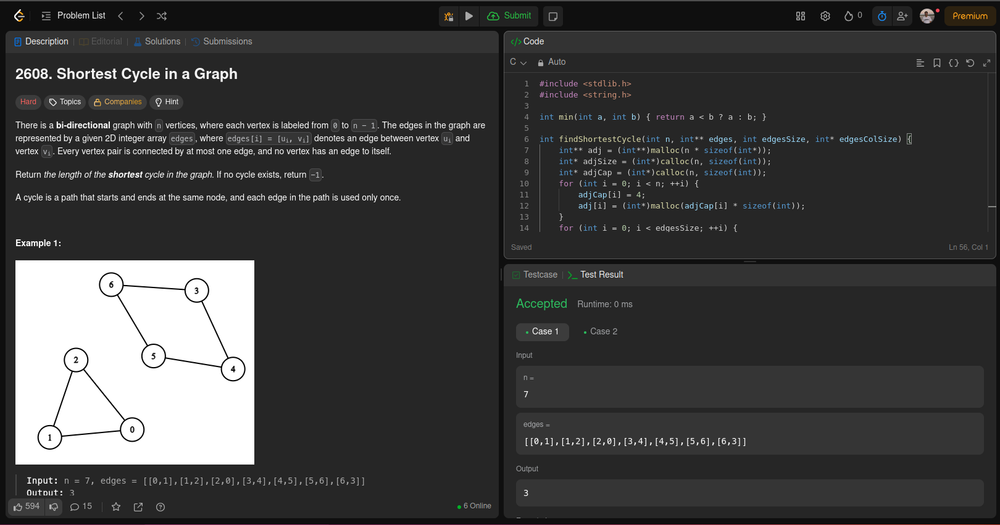
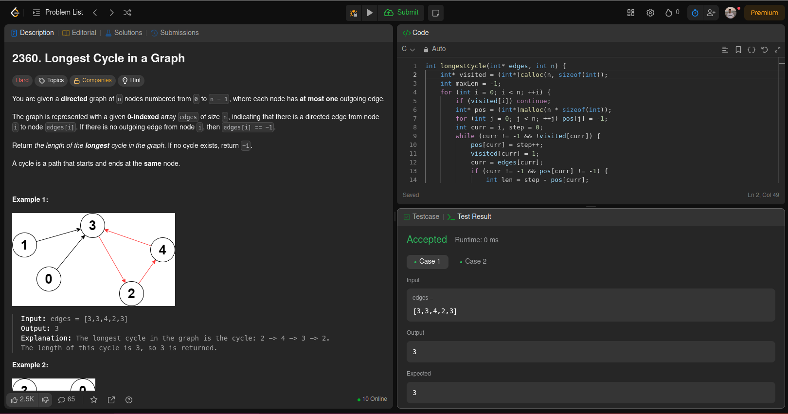
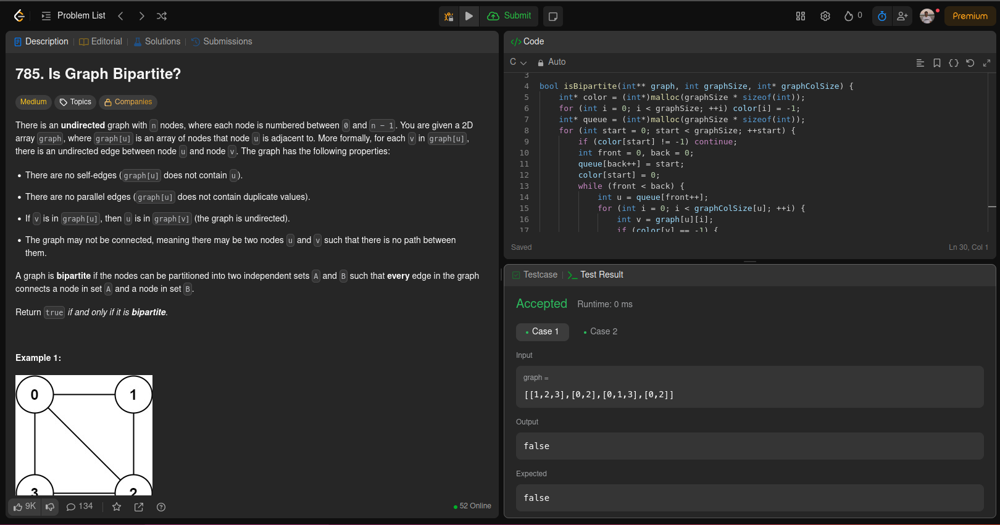

## Alunos
Lucas Antunes de Avelar - 200067095

Yan Luca Viana de Araújo Fontenele - 211031889
## Questões 

## [Shortest Cycle in a Graph](https://leetcode.com/problems/shortest-cycle-in-a-graph/description/)

## [Longest Cycle in a Graph](https://leetcode.com/problems/longest-cycle-in-a-graph/description/)

## [Is Graph Bipartite?](https://leetcode.com/problems/is-graph-bipartite/description/)

# Vídeo explicativo

